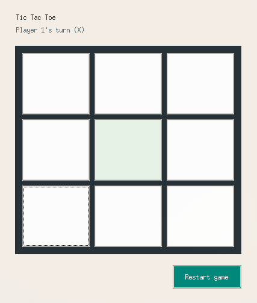

# Tic Tac Toe

A simple desktop Tic Tac Toe game built with Python and Tkinter.

This project was created for the Boot.dev course [First Personal Project](https://www.boot.dev/courses/build-personal-project-1).



## What It Does

- It's a classical Tic Tac Toe game, you know what it does.

## How To Run

Clone the repository:

```bash
git clone https://github.com/samuelvenancio/tic-tac-toe.git
cd tic-tac-toe
```

Run the game:

```bash
python3 main.py
```

## Requirements

- Python 3
- Tkinter